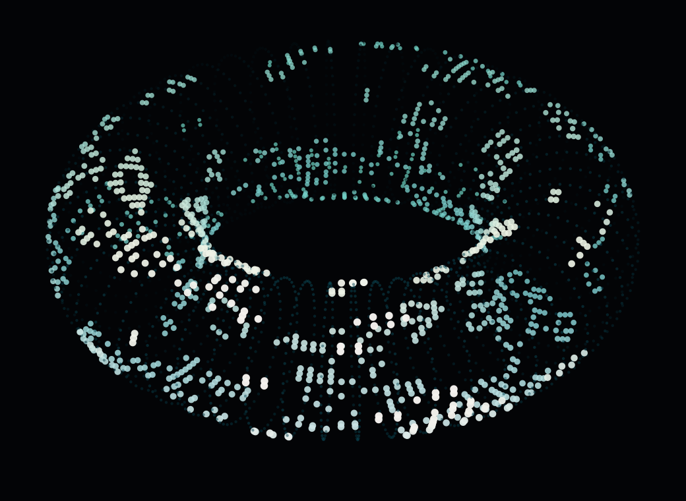
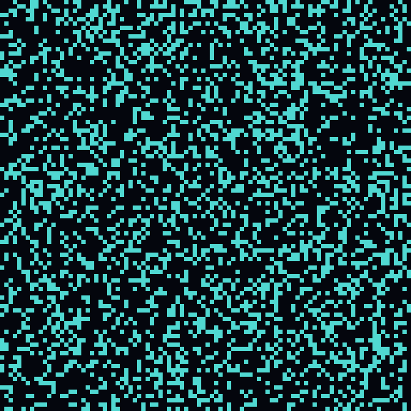
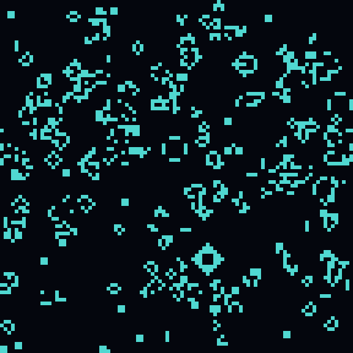
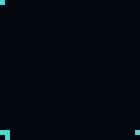
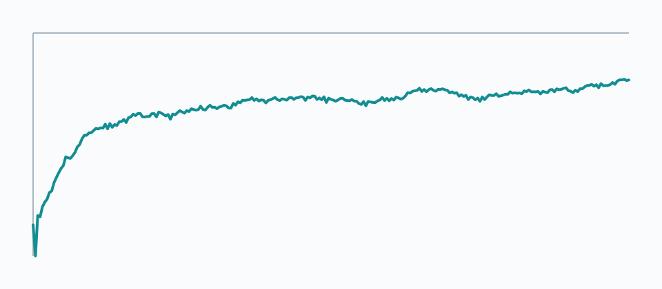

# Metal Toroidal Game of Life

A macOS implementation of Conway's Game of Life on a toroidal plane, accelerated with Apple Metal compute shaders. The simulation wraps at every edge: the left edge touches the right edge, and the top edge touches the bottom edge, so patterns evolve on the surface of a donut instead of a bounded rectangle.



## Features

- GPU simulation in `Shaders.metal` using Metal compute kernels.
- Toroidal neighbor lookup with modular coordinate wrapping.
- Compact `r8Uint` cell-state textures for high grid sizes on Apple Silicon.
- Double-buffered simulation state to avoid read/write hazards.
- Direct compute rendering into the current `MTKView` drawable.
- Pan and zoom controls for inspecting the plane.
- Reproducible PNG visualizations generated from a small CPU reference model.

## Requirements

- macOS with Metal support.
- Apple Silicon recommended.
- Xcode Command Line Tools, including `swiftc`.

## Build And Run

Build the app from the repository root:

```sh
sh build.sh
```

Run it from the repository root so the app can load `Shaders.metal`:

```sh
./GameOfLife
```

The grid size is selected from the GPU working-set budget. You can override it for testing:

```sh
GOL_GRID_SIZE=2048 ./GameOfLife
```

## Controls

- `Space`: pause or resume simulation
- `R`: randomize the plane
- `C`: clear all cells
- `+` / `-`: zoom in or out
- Arrow keys: pan across the toroidal plane

## How The Toroidal Plane Works

In a standard finite grid, edge cells have fewer neighbors unless special boundary rules are added. This project uses toroidal wrapping instead. For each neighbor coordinate, the shader wraps with modular arithmetic:

```metal
uint nx = wrapCoordinate(int(gid.x) + dx, width);
uint ny = wrapCoordinate(int(gid.y) + dy, height);
```

That means a cell at `x = 0` sees cells at `x = width - 1` as immediate neighbors, and a cell at `y = height - 1` sees cells at `y = 0`. Gliders and other moving structures can cross an edge and re-enter from the opposite side.

## Metal Pipeline

The app uses three compute kernels:

- `randomize`: fills the current state texture using a deterministic hash plus a runtime seed.
- `gameOfLife`: reads the current state texture, counts eight wrapped neighbors, applies Conway's rules, and writes the next state texture.
- `visualize`: samples the toroidal simulation plane and writes color directly into the window drawable.

State is stored in two `r8Uint` textures. Each cell is either `0` or `255`, so the simulation avoids the memory cost of float RGBA state textures while remaining easy for the shader to read and write.

## Visualizations

The `Visualizations/` directory contains generated PNG outputs:


| Random seed | Generation 64 |
| --- | --- |
|  |  |

| Glider before wrapping | Glider after wrapping |
| --- | --- |
|  |  |



Regenerate the PNGs with:

```sh
swiftc -module-cache-path .build/module-cache \
  -framework AppKit \
  tools/generate_visualizations.swift \
  -o .build/generate_visualizations

.build/generate_visualizations
```

The visualization tool intentionally uses a smaller CPU reference simulation. It is useful for documentation, density plots, and sanity-checking toroidal wrapping, while the interactive app remains GPU-driven.

## Project Layout

- `GameOfLifeView.swift`: Metal view, texture allocation, input handling, frame loop.
- `Shaders.metal`: GPU kernels for randomization, simulation, and rendering.
- `AppDelegate.swift`: macOS window setup.
- `main.swift`: application entry point.
- `tools/generate_visualizations.swift`: reproducible PNG visualization generator.
- `Visualizations/`: checked-in generated PNG figures.
- `build.sh`: command-line build script.

## License

Apache License 2.0. See `LICENSE`.
